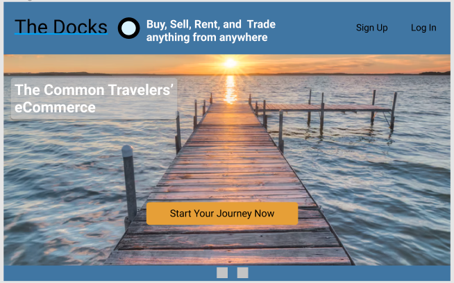
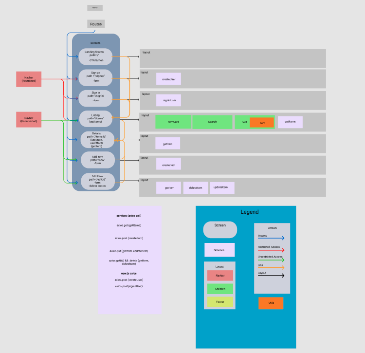
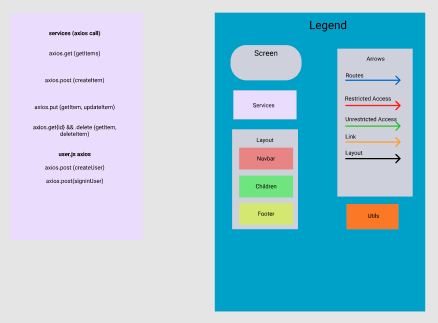
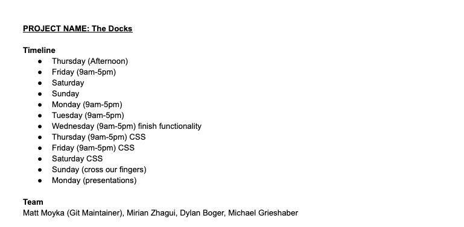

# The-Docks
## Schema
```
//User
const User = new Schema(
  {
    username: { type: String, required: true },
    email: { type: String, required: true },
    password_digest: { type: String, required: true, select: false },
  },
  { timestamps: true }
)

//Item
const Item = new Schema(
  {
    title: { type: String, required: true },
    imgURL: { type: String, required: true },
    description: { type: String, required: true },
    price: { type: String, required: true }
    location: {type: String, required: true}
    category: {type: String, required: true}
  },
  { timestamps: true }
)
```
## Figma Flowchart
[Figma Link](https://www.figma.com/file/FMWiWoZ9561QD5TWLqitI6/The-Docks?node-id=22%3A117)<br/>




## Team Expectations
[Team Expectations Link](https://docs.google.com/document/d/11QMmTNGeQi5h-j7fmmvXzVfQ5R4kYJAmmdJdOCmWrfs/edit?usp=sharing)



## Overview
The docks aims to help help you experience another world or solve a problem you may have. We achieve this through peer to peer renting. Take items that you don't use very often around your house and start making money with them by renting them to others. On the other you can be the renter yourself and test out a new hobby or get some work done while avoiding the high cost barrier to entry created by buying the items new.

## MVP
1. Functional Code
2. user authentication
3. responsiveness
4. full CRUD
5. express and mongoDB backend
6. React frontend
7. deploy to netlify/heroku
8. render info from database


[Github Projects](https://github.com/MattMoyka/The-Dock/projects)